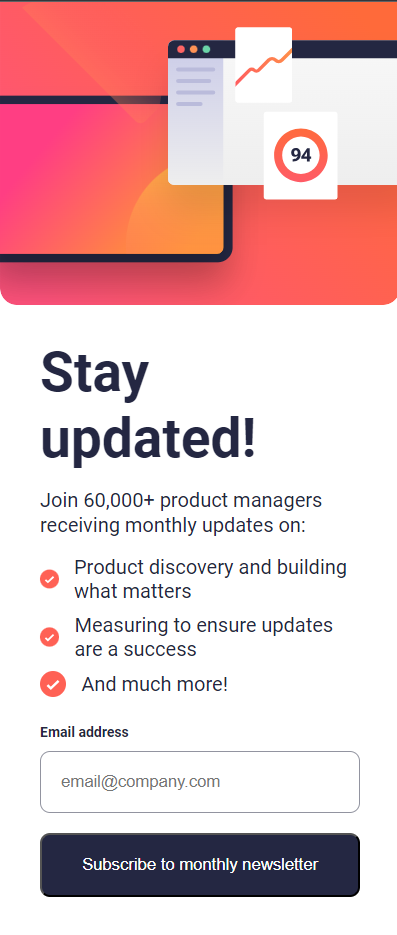

# Frontend Mentor - Newsletter sign-up form with success message solution

This is a solution to the [Newsletter sign-up form with success message challenge on Frontend Mentor](https://www.frontendmentor.io/challenges/newsletter-signup-form-with-success-message-3FC1AZbNrv). Frontend Mentor challenges help you improve your coding skills by building realistic projects. 

## Table of contents

- [Overview](#overview)
  - [The challenge](#the-challenge)
  - [Screenshot](#screenshot)
  - [Links](#links)
- [My process](#my-process)
  - [Built with](#built-with)
  - [What I learned](#what-i-learned)
  - [Continued development](#continued-development)
  - [Useful resources](#useful-resources)
- [Author](#author)

## Overview

### The challenge

Users should be able to:

- Add their email and submit the form
- See a success message with their email after successfully submitting the form
- See form validation messages if:
  - The field is left empty
  - The email address is not formatted correctly
- View the optimal layout for the interface depending on their device's screen size
- See hover and focus states for all interactive elements on the page

### Screenshot




### Links

- Live Site URL: [Live Webpage](https://bmagana5.github.io/newsletter-sign-up-with-success-message/)

## My process

I like to start out with Create React App, gut out all the unnecessary files, bring in the starter material like assets, source code, etc. Then, I like to begin thinking about how I would use and interact with the web component and how it will behave. Once I have a fairly solid foundation for the type of programming logic, state, HTML skeleton, I flesh it out. I then like to set up dimensions, flexbox, and padding and margins. Then, I begin adding in color to text, backgrounds, aligning and justifying elements and text, adding borders, and box-shadows. Then, I work on the React and Javascript logic and test different cases of user input, screen widths, etc.

### Built with

- CSS/Sass custom properties
- Flexbox
- Mobile-first workflow
- [React](https://reactjs.org/) - JS library

### What I learned

This was quite the day project! 

This was useful when setting up the mobile styling. The first child container held the SVG image to be shown at the top. This container scaled with the viewport width, which was desirable. The last container that would hold elements for the header, paragraph, bullet points, and email form would then fill up the remaining area of the parent container with the <code>flex: 1</code> property.

```css
.parent-container {
  display: flex;
  flex-direction: column;
  /*
  *
  *
  *
  */
  .child-container-1 {
    /* properties...*/
  }

  .child-container-last {
    flex: 1;
  }
}
```

Over in React/JavaScript, finding the window dimensions with a React effect hook was very neat! I ended up storing the dimensions in a context so that React components that would like access to the window dimensions could make use of the respective context hook to use that data.

```js
const getWindowDimensions = () => {
    return {
        width: window.innerWidth,
        height: window.innerHeight
    };
};

export const WindowDimensionsProvider = ({ children }) => {
  const [windowDimensions, setWindowDimensions] = useState(getWindowDimensions());
  /*
  *
  *
  *
  */
  useEffect(() => {
      const handleResize = () => {
          setWindowDimensions(getWindowDimensions());
      };

      window.addEventListener('resize', handleResize);
      return () => window.removeEventListener('resize', handleResize);
  }, []);
  /*
  *
  *
  *
  */
}
```

### Continued development

Working with SVG's has been one of the trickiest things. These are something I would definitely like to improve upon.

### Useful resources

- [Media Queries in CSS](https://www.w3schools.com/css/css_rwd_mediaqueries.asp) - This helped me setup media queries for specific device viewport width styling. It was very straightforward on the implementation and explained about common viewport widths in real-world devices.

## Author

Brian Magana
- Frontend Mentor - [@bmagana5](https://www.frontendmentor.io/profile/bmagana5)

